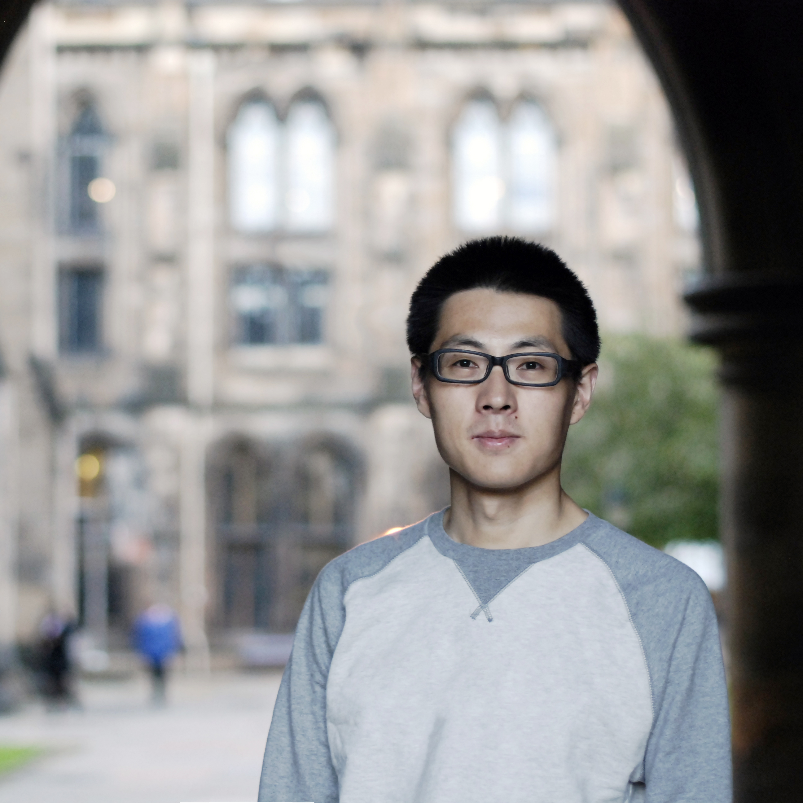

---
---

<link rel="stylesheet" href="styles.css" type="text/css">

  

### About

I am a Ph.D. student in [the Department of Communication Studies at the University of Michigan](https://www.lsa.umich.edu/comm) and the [Graduate Data Science Certificate Program at the Michigan Institute for Data Science (MIDAS)](https://www.midas.umich.edu). My research is at the intersections of political communication, computational social science, and digital politics. I use statistical and computational methods to understand the political implications of digital technologies, particularly the consequences, benefits, and risks of new technologies and data infrastructures. Some of my studies also adopt qualitative methods (e.g., process tracing) to open and explore the black box of digital technologies and algorithms.

In 2014, I was awarded [Chevening Scholarships](https://www.chevening.org/) for my master studies in UK. In May 2018, my two papers were named [Top Student Paper Award from International Communication Association (ICA)](https://www.icahdq.org). In 2018, I received [American Council of Learned Societies Predissertation-Summer Travel Grant](https://www.acls.org/research/fellow.aspx?cid=1F408A97-C739-E811-80D3-000C299476DE) and [Lieberthal-Rogel Travel and Research Fellowship](https://www.ii.umich.edu/lrccs/funding/student-fellowships-grants/doctoral-endowment-award.html) for my field research in China. I also received [International Institute Student Fellowships](https://www.ii.umich.edu/ii/individual-fellowships.html) for my research about data infrastructure and governance in authoritarian regimes. In 2019, my research project on the platformization of propaganda is awarded [Graduate Student Research Grant](https://www.ii.umich.edu/wced/students/funding/research-grant.html) from the Weiser Center for Emerging Democracies (WCED) at UM.

My studies have appeared in *Policy & Internet*, *Communication Research*, *Journal of Communication*, among other peer reviewed journals.

I received B.A. in Public Administration from Shanghai Jiao Tong University and M.Sc.in Political Communication from the University of Glasgow. Prior to academia, I was a newspaper journalist in China.
  
My CV is available [here](https://www.lsa.umich.edu/content/dam/michigan-lsa/people-update/cv/fanliang-03292019-194015-CVFanLiang.pdf)

